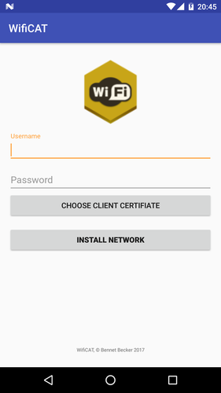

# Android App for Wifi Configuration

## Build the App
Create an Java Keystore and Key
```
keytool -genkey -alias signing -keyalg RSA -keystore app/wificat.keystore -keysize 2048
```
And insert the Keystore password in `app/build.gradle`

Now Build the App using `gradlew`
```
./gradlew assemble
```

## License
the source code is licenced under AGPL v3.0

### External Work
the project uses RootBeer, by scottyab licensed under an Apache-2 license, as an external build
dependency.