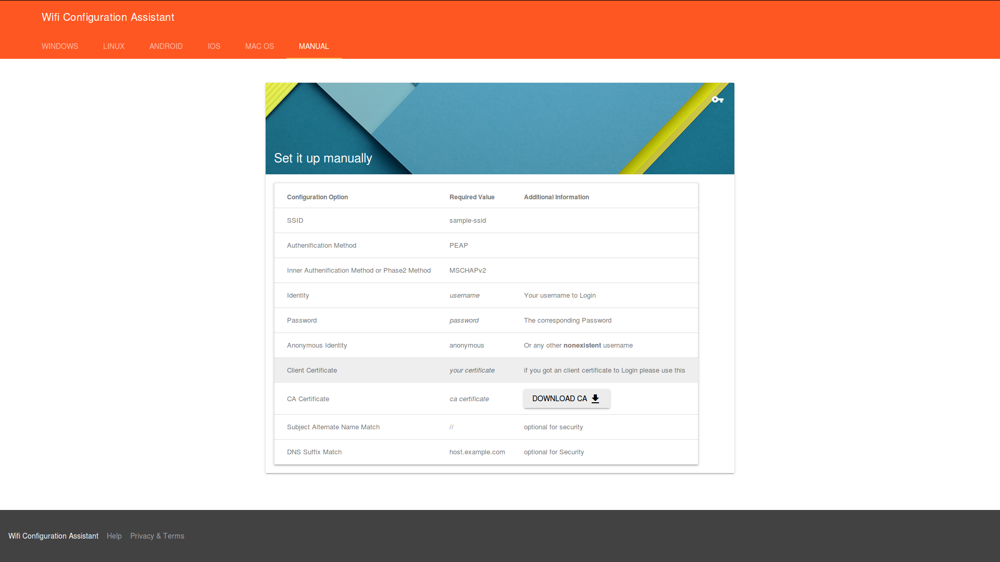

# Webpage for Client Download
This is the Downloadpage for the WifiCAT Tool.

It automatically detects the clients OS and show the appropriate Download

## Licence
the source code is licenced under AGPL v3.0. pictures are licenced under 
[Creative Commons Attribution-NoDerivatives 4.0 International](http://creativecommons.org/licenses/by-nd/4.0/)

### External Work
These files are provied by 3rd-parties and licensed differently as the source code mentioned above

  - `src/jquery.min.js` from JQuery is provided by the JS Foundation under MIT License

  - `src/material{,.min}.{js,css,map}` from Material Design Lite is provided by Google under an Apache-2 license

  - `src/files/dotNetFx40_Full_x86_x64.exe` is the offical .NET Framework 4.0 Installer by Microsoft

  - `src/jsclient.js` by Christian Ludwig (https://stackoverflow.com/questions/9514179/how-to-find-the-operating-system-version-using-javascript/18706818#18706818)

# Screenshots

